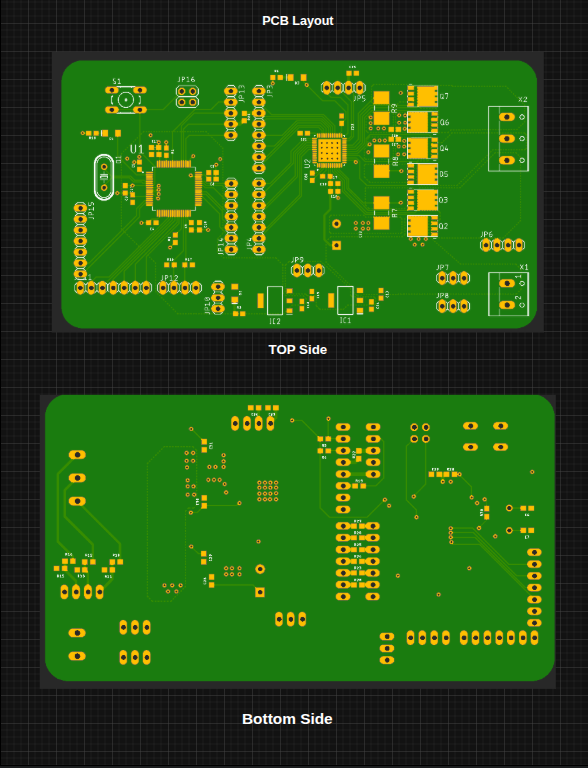
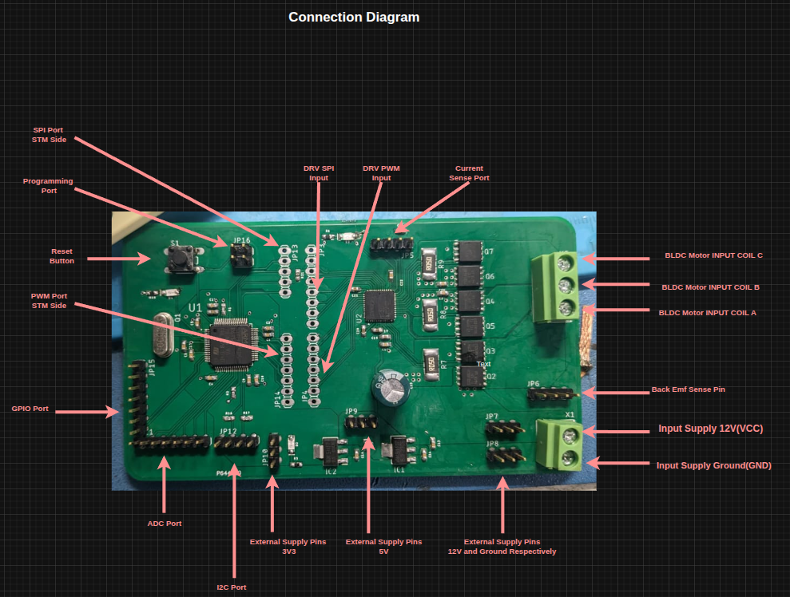
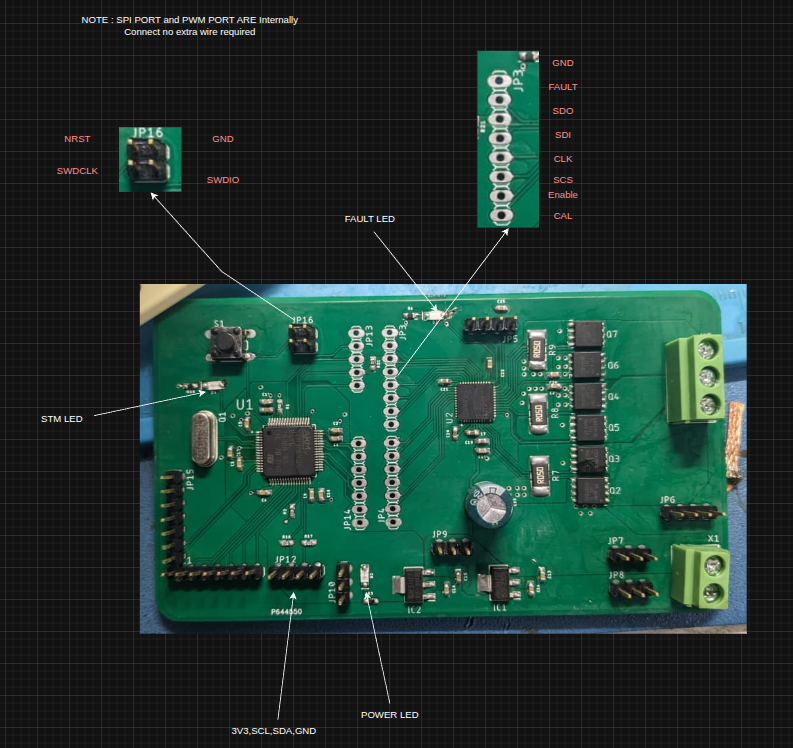

# BLDC Field-Oriented Control Driver

A custom three-phase inverter board and closed-loop firmware for driving a brushless DC (BLDC) motor using **Field-Oriented Control (FOC)**. Developed as my final-year B.Tech thesis and deployed as the pitch-axis actuator of a gimbal demonstrator: an external RC-style PWM signal commands a target angle, and the motor tracks it smoothly through a 3:1 gear reduction.

<p align="center">
  
</p>

## Stack at a glance

| Layer | Choice |
| --- | --- |
| MCU | STM32G431 (Cortex-M4F + CORDIC coprocessor) |
| Commutation | 6-PWM, voltage-mode FOC ([SimpleFOC](https://simplefoc.com/)) |
| Position sensor | MA730 14-bit magnetic encoder (SPI) |
| Power stage | 3× half-bridge, TI N-channel MOSFETs |
| Setpoint input | RC-style PWM (timer input capture) |
| PCB tool | Autodesk EagleCAD |
| Bus voltage | 12 V (nominal) |

## Visuals

| PCB layout | Wiring diagram |
| --- | --- |
|  |  |

Communication interface:



## Repository layout

```
.
├── Assets/                              Demo GIF, connection diagrams, PCB render, final paper
├── Hardware_assets/
│   ├── Design_FIle(EagleCad)/           EagleCAD .brd + .sch sources
│   ├── Schematic/                       Exported PDF schematic
│   ├── Gerber_file/                     Fabrication-ready Gerbers (.zip)
│   └── BOM_&_Component_selection/       MOSFET trade-off spreadsheet
├── Firmware/
│   └── bldc-doc-driver/                 Arduino sketch (SimpleFOC on STM32G4)
└── README.md
```

## Hardware design

The board is a three-phase inverter built around three half-bridges of TI N-channel power MOSFETs, with an MA730 magnetic encoder front-end and a PWM-input pin exposed to an off-board receiver. A mechanical limit switch on the pitch axis provides a repeatable zero for homing.

**MOSFET selection** — the workbook in `Hardware_assets/BOM_&_Component_selection/` compares two TI candidates evaluated for the low-side/high-side switches:

| Part | Vds | Id | Rds(on) max | Qg | Notes |
| --- | --- | --- | --- | --- | --- |
| `CSD18510Q5B` | 40 V | 42 A | 1.2 mΩ | 118 nC | Lower Qgd, lower voltage headroom |
| `CSD18536KCS` | 60 V | 200 A | 1.3 mΩ | 108 nC | Higher Vds margin, much higher current rating |

Both sit at roughly 1.2–1.3 mΩ Rds(on), so the choice comes down to voltage headroom above the 12 V bus and thermal budget rather than conduction loss.

**Design artefacts**

- EagleCAD sources — [`Hardware_assets/Design_FIle(EagleCad)/Layout_Design_File.sch`](Hardware_assets/Design_FIle(EagleCad)/Layout_Design_File.sch), [`Schematic_Design_File.brd`](Hardware_assets/Design_FIle(EagleCad)/Schematic_Design_File.brd)
- Schematic PDF — [`Hardware_assets/Schematic/Final_Schematic.pdf`](Hardware_assets/Schematic/Final_Schematic.pdf)
- Gerbers — [`Hardware_assets/Gerber_file/Final_Gerber_File.zip`](Hardware_assets/Gerber_file/Final_Gerber_File.zip)

## Firmware

Sketch: [`Firmware/bldc-doc-driver/bldc-doc-driver.ino`](Firmware/bldc-doc-driver/bldc-doc-driver.ino).

**Control law** — SimpleFOC angle-control cascade: `angle (P) → velocity (PI) → q-axis voltage`. Torque mode is `TorqueControlType::voltage`, pole pairs are set to 7, and the motor voltage limit is clamped to `V_PSU / 2` for headroom.

**Parameters** (from the sketch)

| Define / field | Value |
| --- | --- |
| `V_PSU`, `V_LIMIT` | 12.0 V |
| `GEAR_REDUCTION` | 3 (pitch axis) |
| `ACCESSIBLE_ANGLE` | 3.00 rad of mechanical pitch travel |
| `PWM_IN_MIN` / `PWM_IN_MAX` | 4.94 % / 10.06 % duty (≈1.0–2.0 ms pulses) |
| `PID_velocity` P / I / D | 0.2 / 4 / 0 |
| `P_angle.P` | 10 |
| `velocity_limit` | 50 rad/s |

**Startup sequence**

1. Bring up the debug serial (`Serial3`, 115200), the STM32G4 CORDIC unit, the PWM input capture, and the MA730 sensor.
2. Configure driver + motor, run SimpleFOC `initFOC()` electrical alignment.
3. **Homing** — drive the motor slowly toward the limit switch; when it trips, snapshot the encoder angle as `max_angle`, compute `min_angle = max_angle − (ACCESSIBLE_ANGLE × GEAR_REDUCTION)`.
4. Build a linear mapper from input PWM duty `[4.94 %, 10.06 %]` onto `[min_angle, max_angle]`.

**Main loop** — `motor.loopFOC()` runs the current/voltage inner loop; each iteration the PWM-input duty is sampled, mapped to a target angle, clamped to the calibrated travel, and passed to `motor.move(target_angle)`.

### Library dependencies

- [SimpleFOC](https://github.com/simplefoc/Arduino-FOC) — `BLDCMotor`, `BLDCDriver6PWM`
- [SimpleFOC Drivers](https://github.com/simplefoc/Arduino-FOC-drivers) — `MagneticSensorMA730`, `STM32PWMInput`, `STM32G4CORDICTrigFunctions`, `STM32FlashSettingsStorage`
- [Arduino core for STM32 (stm32duino)](https://github.com/stm32duino/Arduino_Core_STM32) — board target: **Generic STM32G4 series / STM32G431xx**

### Build & flash (Arduino IDE)

1. Install Arduino IDE 2.x and the **STM32** boards package following stm32duino's instructions.
2. From Library Manager, install `SimpleFOC` and `SimpleFOC Drivers`.
3. Open `Firmware/bldc-doc-driver/bldc-doc-driver.ino`.
4. Board → *Generic STM32G4 series*; part → *STM32G431xx*; upload method → *STM32CubeProgrammer (SWD)* via an ST-Link.
5. Compile and flash.

### Known gaps / roadmap

- **`G431_hw.h` is not yet committed.** The sketch `#include`s this header for board-specific pin aliases (`SENSOR1_CS`, `MOT1_OUT_H/L` … `MOT3_OUT_H/L`, `ENABLE`, `LIMIT_SW`, `PWM_IN2`, `PIN_SERIAL_RX/TX`). It will be added once the final pin map is locked down against the EagleCAD schematic — the sketch will not compile until then.
- **STM32CubeIDE port** — planned. A HAL/LL implementation in STM32CubeIDE (native 6-PWM timer configuration, ADC-based phase current sensing, CORDIC-accelerated Park/Clarke) is on the roadmap as a production-grade replacement for the Arduino prototype. Not yet in-tree.

## Research paper

Full write-up covering FOC theory, hardware design rationale, and results: [`Assets/Final_Paper.pdf`](Assets/Final_Paper.pdf).
